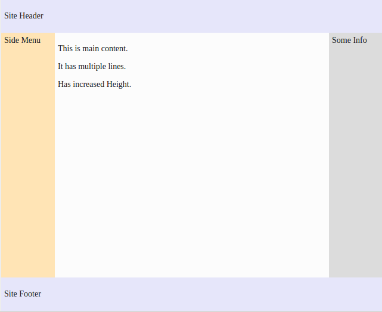
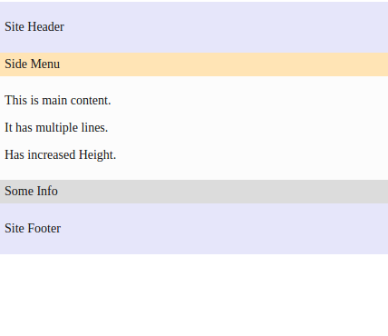

##Exercise - Holy Grail Layout

##Description
Holy Grail Layout is a superset of some of the commonly used layouts found.
It consists of a header, a footer and a main content area with a left 
sidebar (let's say for side menu) and a right sidebar (let's say for some additional info).
While there are few [well known solutions](http://alistapart.com/article/holygrail) it was still a difficult layout to create simply in CSS without any hacks.

Problem structure is present at : [Holy Grail Layout Problem](http://jsbin.com/helomi/1/edit?html,css,output).

Here we have a ***header*** and ***footer*** at the top and the bottom respectively.
In-between we have a container, containing the main content (having ***content*** class)
 with side menu on the left (having ***side-menu*** class) and an info panel on the right (having ***side-info***).

Aim of this exercise is to create the holy grail layout so that:-
* Main content has fluid width with fixed-width sidebars.
* Main content and the side bars should form three equal height columns.
    * Assume the fixed width to be 80px for both.
* The footer should “stick” to the bottom of the page when content is sparse.
* The layout should be responsive and the sections should collapse into one column on smaller viewports. 
    * Assume breakpoint to be 500px.

The final page should resemble :-

* For large screens 
 
 
* For small screens
  

##Solution
The solution can be found at [Holy Grail Layout Solution](http://jsbin.com/sevilu/1/edit?html,css,output).

#### Details
Apply flex with direction column to body and the content.
```css
body, .container {
  display: flex;
  flex-direction: column;
}
```

Lower the order of side-menu so that it appears before the main content.
```css
.side-menu {
  order: -1;
}
```

The above fixes the layout for small screens. Now, we need to fix the layout for larger screens.
First create the media query block inside which the css for larger screens would be present. 
```css
@media screen and (min-width: 500px) {
 /* CSS for large screen */
}
```

Set the flex direction for the container to be row as they need to be in a row for larger screens. 
Also, ensure that it has fluid height to take up any available space.
```css
.container {
  flex-direction: row;
  flex: 1;
}
```

Set the widths for the side menu and info as required and ensure that that main content has fluid.
```css
.content {
  flex: 1;
}

.side-menu, .side-info {
  width: 80px;
} 
```

Finally, set the body height to full viewport height so that the footer sticks to bottom
```css
body {
  min-height: 100vh;
}
```

### Notes
* The ***order*** property only changes the visual order of the element but not the logical order or tab order.
 Hence, ***order*** must not be used on non-visual media such as speech.
* We have used mobile first approach here, the css can be different in case of a desktop first approach.
* An obvious observation, but note that for large screens ***flex: 1*** grows the container along the height but grows the main content along the width.
 This is due to different flex-direction and hence different main-axis. 
