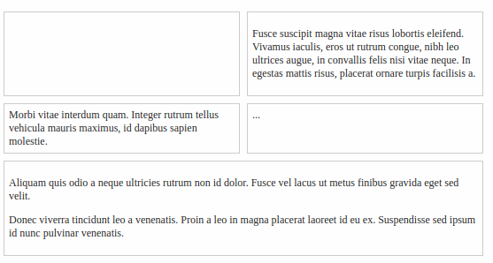

#Exercise - Grid which fills up available space

##Description
Flexbox enables the creation of flexible and responsive grids quite easily. 
This problem tries to demonstrate that by creating a simple grid.

Problem structure is present at : [Stretching Grid Problem](http://jsbin.com/podoli/2/edit?html,css,output)
Here will have grid container which is denoted by class ***grid*** and the elements of the grid are denoted by class ***grid-element***.
The grid elements have some pre-defined spacing, padding and border which should not be changed.

The grid should be created by changing the css so that:-
* Each row in the grid has no more than two elements.
* All the elements in a row have equal width.
* Elements should stretch to fill up the available space.

##Solution
The solution can be found at [Stretching Grid Solution](http://jsbin.com/punukar/2/edit?html,css,output).

The final page should resemble :-


### Details
Ensure that the grid container can wrap it's element. This is required so that additional elements can move to a new line.
```css
.grid {
  display:flex;
  flex-wrap: wrap;
}
```

On the grid elements, set a min-width so that only two elements can be displayed in a row. 
Additionally, set flex-grow to 1 so that the elements can take up the available space and flex-basis to 0 to set 0 starting width.
We can use the shorthand ***flex*** property for this.
```css
.grid-element {
  flex:1;
  min-width: calc(50% - 8px);
}
```

### Notes
* We had to use calc as we need to take margin into account while setting half width for the grid elements. 
We do not need to take padding into account as we have specified ***box-sizing as border-box***
* ***flex-basis*** has to be set to 0 so that the grid elements are not sized on the basis of their content but expand to take up the available the space.
* In the above solution, elements in the same row have the same height irrespective of the content, which shows how easily we can create equal height columns using flex.  
